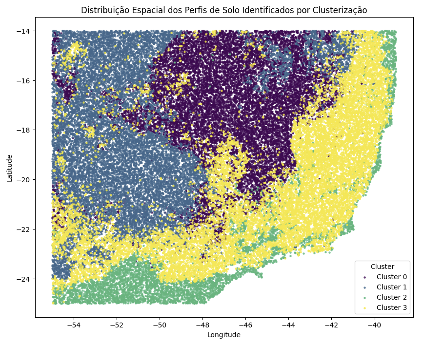
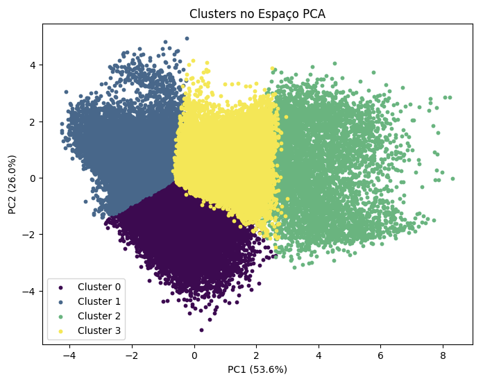
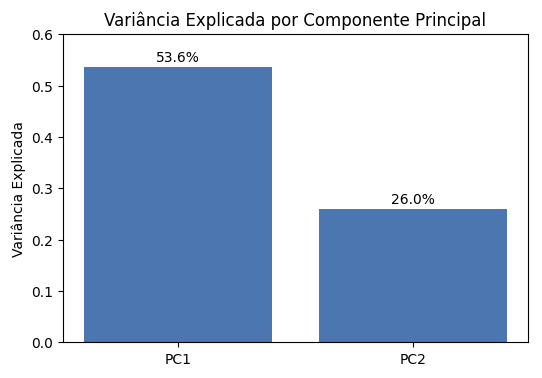
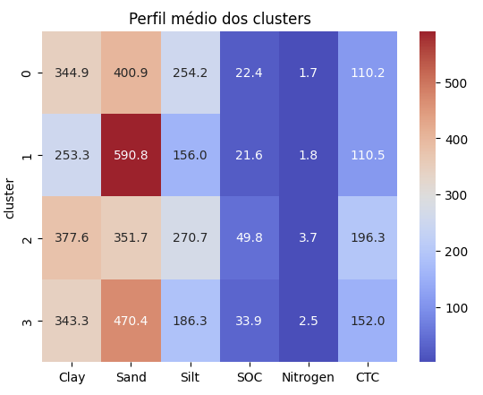

# Clusterização Espacial de Atributos do Solo com Machine Learning

## Descrição do Projeto

Este projeto aplica técnicas de aprendizado não supervisionado para identificar padrões espaciais em atributos físico-químicos do solo na Região Sudeste do Brasil.

A partir de dados geoespaciais do SoilGrids, foi construída uma base de dados estruturada contendo variáveis como pH, carbono orgânico, nitrogênio, textura e densidade do solo na camada superficial (0–5 cm).

O objetivo é responder à seguinte pergunta:

É possível identificar zonas homogêneas com base em atributos do solo utilizando técnicas de Machine Learning?

Importante: este estudo não tem como objetivo classificar tipos de solo no sentido pedológico, mas sim identificar padrões e agrupamentos com base em atributos físico-químicos.

  

  <small><strong>Figura 1.</strong> Distribuição espacial dos clusters de solo identificados por meio de técnicas de aprendizado não supervisionado.</small>

## Objetivos

 - Construir um dataset a partir de rasters geoespaciais
- Analisar a estrutura multivariada dos dados
- Reduzir dimensionalidade com PCA
- Identificar padrões com clusterização (K-Means)
- Interpretar os clusters com base em atributos do solo no contexto ambiental

## Metodologia

O projeto foi dividido em três etapas principais:

### 1. Construção do Dataset
- Leitura de rasters (GeoTIFF)
- Empilhamento das variáveis
- Conversão para estrutura tabular
- Tratamento de valores inválidos

### 2. Análise Exploratória e PCA
- Análise de correlação
- Padronização dos dados
- Redução de dimensionalidade (PCA)
- Identificação de gradientes estruturais

  

  <small><strong>Figura 2.</strong> Projeção dos dados no espaço dos dois primeiros componentes principais (PCA).</small>

  

  <small><strong>Figura 3.</strong> Variância explicada pelos componentes principais, indicando a proporção da informação dos dados capturada por cada componente.</small>

### 3. Clusterização
- Aplicação do K-Means
- Definição do número de clusters
- Análise dos perfis médios dos clusters
- Visualização espacial dos agrupamentos

  

  <small><strong>Figura 4.</strong> Comparação das médias das variáveis por cluster, destacando os diferentes perfis de solo identificados pelo modelo.</small>

## Principais Resultados

- Identificação de padrões espaciais consistentes no em atributos do solo 
- Evidência de dois gradientes dominantes: químico e textural  
- Segmentação dos dados em grupos com perfis distintos de atributos físico-químicos
- Coerência espacial dos clusters, indicando estrutura não aleatória  

---

## Aplicações

- Planejamento agrícola  
- Manejo do solo  
- Zoneamento ambiental  
- Apoio à tomada de decisão baseada em dados

---

## Tecnologias Utilizadas

- Python
- NumPy
- Pandas
- Rasterio
- Scikit-learn
- Matplotlib / Seaborn

---

## 📁 Estrutura do Projeto

soil-clustering-ml/                                
│                            
├── data/                                   
│   ├── raw/              
│   └── processed/                                            
│
├── notebooks/                                         
│   01_dataset_construction.ipynb                                
│   02_exploratory_analysis_pca.ipynb                                                                
│   03_clustering_spatial_patterns.ipynb                                                            
│
├── images/                                      
│
├── src/                                         
│
├── README.md                                       
├── requirements.txt                          
└── .gitignore  

# Como executar o Projeto

git clone https://github.com/claudiarpaim/Spatial_Clustering_Soil.git                               
cd Spatial_Clustering_Soil                           
pip install -r requirements.txt                                          

# Autora

## Cláudia Rosa
Cientista de Dados Júnior | Química Ambiental

LinkedIn: https://www.linkedin.com/in/claudia-rosa-datascience                                     
Email: claudiarpaim@gmail.com

